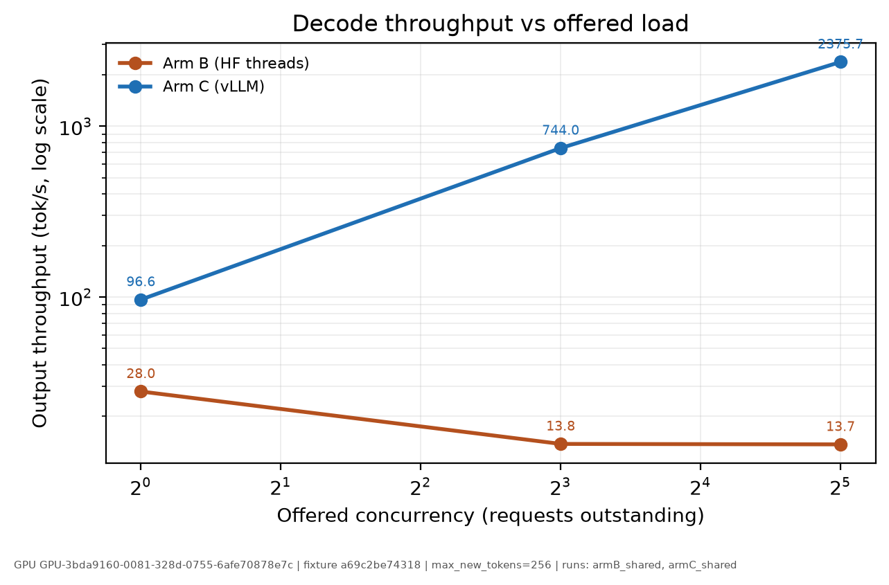
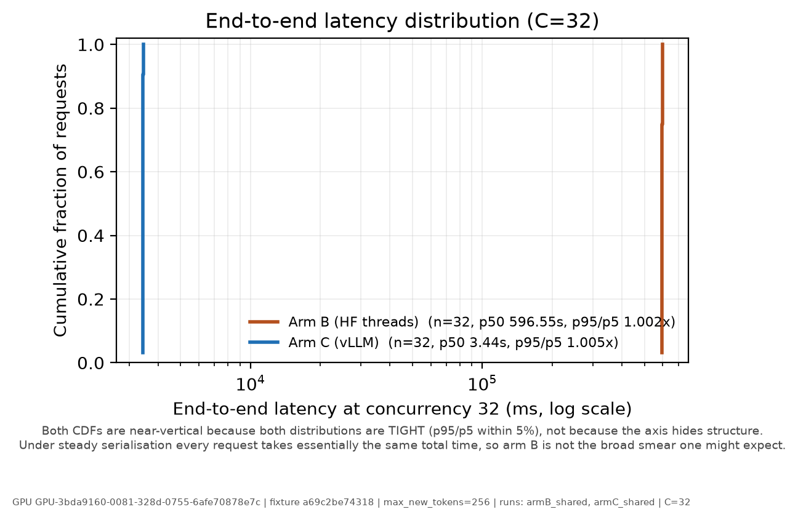
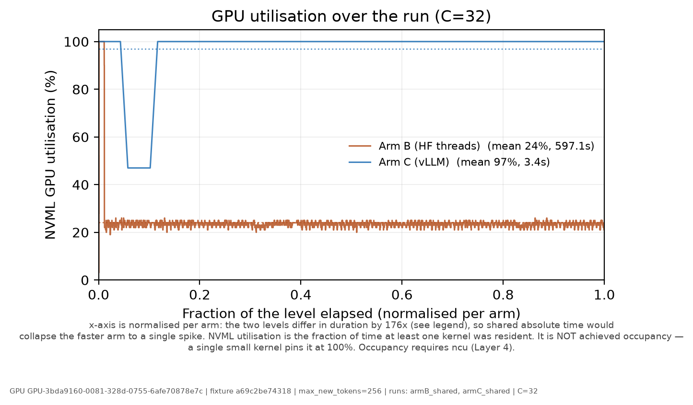
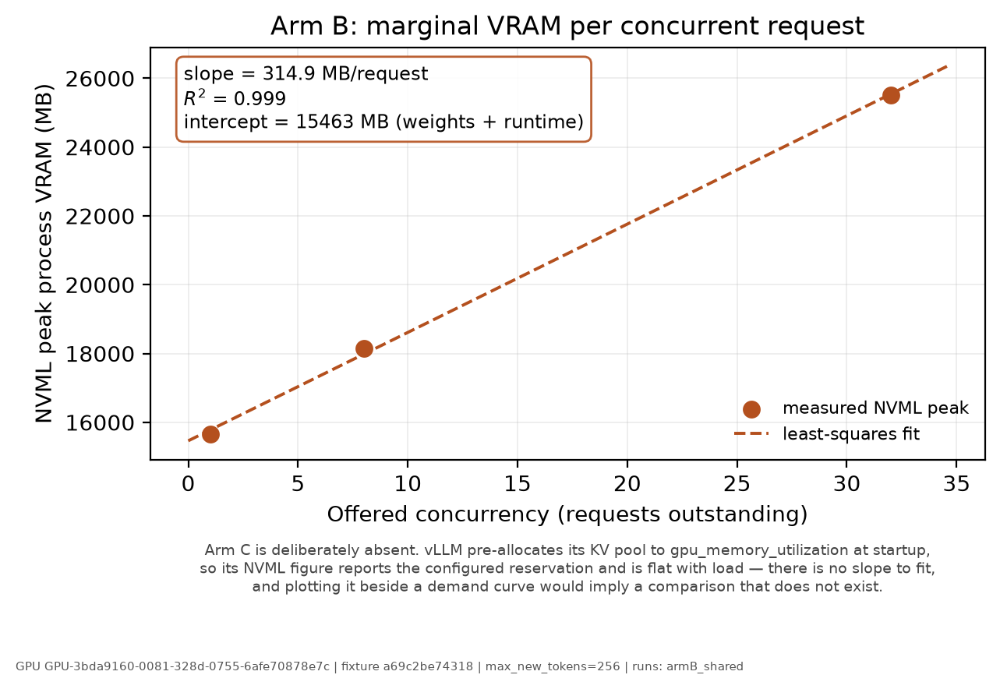
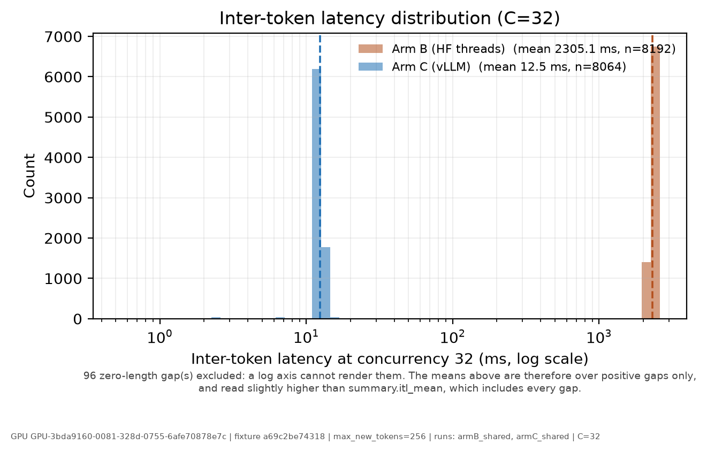
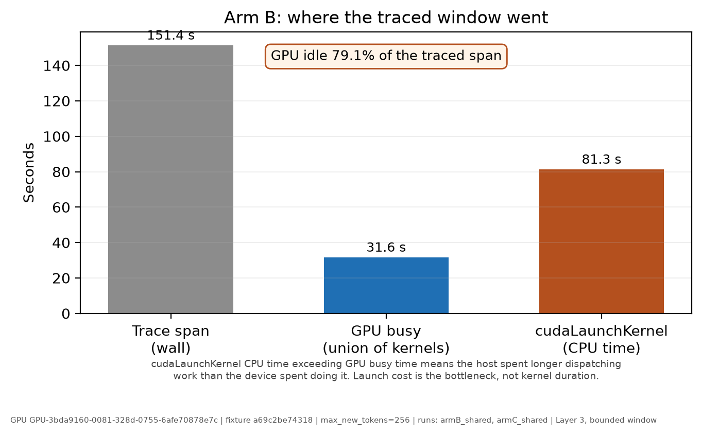

# GPU serving benchmark — results

> **Generated file. Do not edit.** Regenerate with:
>
> ```bash
> python -m analysis.make_results --arm-b results/armB_shared_summary.json --arm-c results/armC_shared_summary.json --trace-analysis results/armB_L3_trace.json --out analysis/RESULTS.md --figures-dir analysis/figures --render-figures --concurrency 32 --exclude results/smoke_c1_summary.json=superseded — ran on a DIFFERENT GPU (GPU-dd1b2c9f…) and a different pip freeze; excluded rather than silently dropped --exclude results/smoke_vllm_c1_summary.json=smoke test only (4 requests, C=1); not part of the matched sweep --note Harness commits differ but the measurement code does not=Arm B ran at `141e5a5`, arm C at `f40ae8b`. `git diff --name-only 141e5a5 f40ae8b` touches only `common/torchvision_shim.py`, its tests, and `RUN_MANIFEST_SCHEMA.md`. `common/metrics.py`, `common/monitor.py`, `common/fixtures.py` and `runners/` are byte-identical, so both arms were measured by the same code.
> ```

Every number below is read from a `*_summary.json` and attributed to a `run_id`. Nothing is transcribed by hand.

## 1. Provenance

| Field | Value |
|---|---|
| GPU UUID | `GPU-3bda9160-0081-328d-0755-6afe70878e7c` |
| GPU | `NVIDIA A100-SXM4-80GB` |
| Driver | `580.82.07` |
| CUDA (torch-linked) | `13.0` |
| Model | `Qwen/Qwen2.5-7B-Instruct` |
| Fixture | `shared_prefix` |
| Fixture sha256 | `a69c2be743189489d0ab5b4a2f7fe09c163fdf3cd034429a904840e810135968` |
| Context tokens | `2620` |
| max_new_tokens | `256` |
| Config sha256 | *(differs across runs, or absent)* |
| pip freeze sha256 | `29deea666a5c3e1634e7f22d2f4e9bec183545d396bd8ddef7a78db581e48dae` |
| torchvision shim active | *(differs across runs, or absent)* |
| Upstream SHA | `030b17701afd8d366aa1e40c4beeb4c5dde8d2b2` |
| Branch SHA | *(differs across runs, or absent)* |

**How `config_sha256` was checked:** Runs span arms B, C. config_sha256 hashes the RESOLVED config, which for arm C includes the vLLM serving knobs (enable_prefix_caching, max_num_seqs, gpu_memory_utilization) — those knobs are the independent variable, so the hashes differ by design. The shared controlled variables were verified individually instead (model, context_tokens, fixture_name), alongside gpu_uuid, fixture_sha256, max_new_tokens, pip_freeze_sha256. Nothing that must be held constant went unchecked.

### Runs included

| run_id | Arm | Levels | Layer | Timestamp |
|---|---|---|---|---|
| `armB_shared` | B | [1, 8, 32] | 1 | 2026-08-06T02:32:11Z |
| `armC_shared` | C | [1, 8, 32] | 1 | 2026-08-06T02:58:35Z |

### Runs excluded

Listed rather than silently dropped — an unexplained gap in the results is indistinguishable from a deleted bad result.

| Run | Reason for exclusion |
|---|---|
| `smoke_c1_summary.json` | superseded — ran on a DIFFERENT GPU (GPU-dd1b2c9f…) and a different pip freeze; excluded rather than silently dropped |
| `smoke_vllm_c1_summary.json` | smoke test only (4 requests, C=1); not part of the matched sweep |

## 2. Matched comparison

Compared at levels present in every run: **[1, 8, 32]**.

### Concurrency 1

| Metric | Unit | Arm B (HF threads) | Arm C (vLLM) |
|---|---|---|---|
| TTFT p50 | ms | 197.0 | 20.1 |
| TTFT p95 | ms | 197.9 | 23.6 |
| TTFT p99 | ms | 198.0 | 130.8 |
| e2e p50 | ms | 9139.8 | 2646.1 |
| e2e p95 | ms | 9226.4 | 2647.2 |
| e2e p99 | ms | 9279.0 | 2756.3 |
| ITL mean | ms | 34.96 | 10.30 |
| ITL p95 | ms | 37.25 | 10.57 |
| input throughput | tok/s | 286.4 | 988.3 |
| output throughput | tok/s | 28.0 | 96.6 |
| total throughput | tok/s | 314.4 | 1084.8 |
| completed | req/s | 0.109 | 0.377 |
| wall time | s | 292.74 | 84.84 |
| completed | requests | 32 | 32 |
| errors | requests | 0 | 0 |
| GPU utilisation mean | % | 43.9 | 99.7 |
| CPU utilisation mean | % | 10.6 | 5.1 |

### Concurrency 8

| Metric | Unit | Arm B (HF threads) | Arm C (vLLM) |
|---|---|---|---|
| TTFT p50 | ms | 722.8 | 50.4 |
| TTFT p95 | ms | 1624.1 | 204.0 |
| TTFT p99 | ms | 1637.7 | 204.7 |
| e2e p50 | ms | 148287.0 | 2711.4 |
| e2e p95 | ms | 149787.5 | 2865.3 |
| e2e p99 | ms | 150211.3 | 2866.0 |
| ITL mean | ms | 575.41 | 10.45 |
| ITL p95 | ms | 642.73 | 10.77 |
| input throughput | tok/s | 141.3 | 7614.4 |
| output throughput | tok/s | 13.8 | 744.0 |
| total throughput | tok/s | 155.1 | 8358.4 |
| completed | req/s | 0.054 | 2.906 |
| wall time | s | 593.40 | 11.01 |
| completed | requests | 32 | 32 |
| errors | requests | 0 | 0 |
| GPU utilisation mean | % | 24.1 | 99.0 |
| CPU utilisation mean | % | 18.9 | 5.7 |

### Concurrency 32

| Metric | Unit | Arm B (HF threads) | Arm C (vLLM) |
|---|---|---|---|
| TTFT p50 | ms | 6381.3 | 298.0 |
| TTFT p95 | ms | 6492.1 | 306.8 |
| TTFT p99 | ms | 6503.8 | 307.7 |
| e2e p50 | ms | 596475.8 | 3437.8 |
| e2e p95 | ms | 597065.7 | 3446.3 |
| e2e p99 | ms | 597106.6 | 3447.1 |
| ITL mean | ms | 2305.11 | 12.31 |
| ITL p95 | ms | 2419.96 | 12.86 |
| input throughput | tok/s | 140.4 | 24313.8 |
| output throughput | tok/s | 13.7 | 2375.7 |
| total throughput | tok/s | 154.1 | 26689.5 |
| completed | req/s | 0.054 | 9.280 |
| wall time | s | 597.12 | 3.45 |
| completed | requests | 32 | 32 |
| errors | requests | 0 | 0 |
| GPU utilisation mean | % | 24.2 | 96.9 |
| CPU utilisation mean | % | 19.9 | 3.0 |

## Memory (reported separately — NOT comparable across arms)

These figures are **not** placed in one table on purpose.

- **Arm B** allocates on demand: NVML peak grows with concurrency because each in-flight request holds its own KV cache. The number is a measurement.
- **Arm C** pre-allocates: vLLM reserves `gpu_memory_utilization` of the device for its KV pool at startup, so NVML reports the *configured* reservation and stays flat under load. The number is a setting.

Reading them side by side suggests arm C "uses more memory". It does not — it reserves what it was told to. Arm C's demand signal is `notes.kv_cache.usage_perc_peak`, which requires the vLLM stats path to have resolved.

### Arm B (HF threads)

| Concurrency | NVML peak | NVML steady-state |
|---|---|---|
| 1 | 15648 | 15648 |
| 8 | 18150 | 18148 |
| 32 | 25502 | 25502 |

### Arm C (vLLM)

`gpu_memory_utilization = 0.9` — the NVML figures below are bounded by this setting, not by demand.

| Concurrency | NVML peak | NVML steady-state |
|---|---|---|
| 1 | 74933 | 74933 |
| 8 | 74933 | 74933 |
| 32 | 74933 | — |

> Steady-state is `—` at concurrency [32]: the level finished before the monitor's warm-up window elapsed, so no post-warm-up samples exist. Peak is still valid.

> KV-cache usage and prefix-cache hit rate are **absent**: the vLLM stats path did not resolve on this build (`stats_source: null`). Absent is not zero — no demand-side memory number is available for this arm.

## 3. Per-request behaviour

From `*_raw.json`; not derivable from the summary.

### Arm B (HF threads) — C=32

- **ITL trajectory:** flat-but-slow (steady serialisation) (first decile 2297.4 ms -> last 2212.6 ms, drift -3.7%)
- **Submission-order effect:** no strong submission-order penalty; cost spread across requests (Spearman rho -0.405)
- **ignore_eos check:** every request emitted exactly 256 tokens

### Arm C (vLLM) — C=32

- **ITL trajectory:** flat after an initial transient — the first bin differs, the rest is steady (NOT progressive build-up) (first decile 10.3 ms -> last 12.7 ms, drift +22.8%)
- **Submission-order effect:** later requests were served FASTER — TTFT falls monotonically with submission order, consistent with joining an already-warm batch rather than queueing behind one (Spearman rho -1.000)
- **ignore_eos check:** every request emitted exactly 256 tokens

## 4. Figures

### fig1_throughput_vs_concurrency



Output token throughput against offered concurrency, log y. The two arms move in opposite directions with load, which is the study's headline: adding concurrency to a stack with no batching does not add throughput.

### fig2_latency_cdf



Empirical CDF of end-to-end latency. Percentiles compress away the shape of a distribution; the CDF shows whether latency is a tight spike or a broad smear, which p50/p95/p99 alone cannot distinguish.

### fig3_gpu_utilisation_timeseries



NVML GPU utilisation over the level, both arms on shared axes with time normalised to level start. NVML utilisation is the fraction of time at least one kernel was resident — it is NOT achieved occupancy, which requires ncu (Layer 4).

### fig4_vram_slope



Arm B only: NVML peak VRAM against concurrency, with a least-squares fit. The slope is the marginal cost of one concurrent request; the intercept is the fixed cost of weights plus runtime. Arm C cannot appear — it pre-allocates its KV pool, so its VRAM is a configuration value with no slope to fit.

### fig5_itl_distribution



Inter-token latency histogram at matched concurrency, log x. ITL measures the gap between consecutive tokens, so N tokens yield N-1 samples; the first interval is TTFT and is excluded.

### fig6_launch_overhead



Arm B, Layer 3: wall time of the traced window against GPU busy time (the union of kernel intervals, so stream overlap is counted once) and cudaLaunchKernel CPU time. Launch cost exceeding GPU busy time means the host spent longer dispatching work than the device spent doing it.

## 5. Measured vs not yet measured

Assessed by inspecting the artifacts, not asserted.

| Metric | Layer | Status | Source |
|---|---|---|---|
| TTFT p50/p95/p99 | 1 | measured | `summary.levels[].ttft_p*` |
| Inter-token latency (mean/p95, full distribution) | 1 | measured | `summary + raw` |
| End-to-end latency p50/p95/p99 | 1 | measured | `summary.levels[].e2e_p*` |
| Input / output / total token throughput | 1 | measured | `summary.levels[]` |
| Completed requests per second | 1 | measured | `summary.levels[]` |
| VRAM peak and steady-state | 1 | measured | `summary.levels[].resources` |
| CPU utilisation | 1 | measured | `summary.levels[].resources` |
| GPU utilisation (kernel residency) | 1 | measured | `summary.levels[].resources` |
| Marginal VRAM per request (slope) | 1 | measured | `vram_slope across levels` |
| Kernel timeline / stream overlap | 2/3 | measured | `trace_analysis` |
| cudaLaunchKernel / sync / memcpy CPU breakdown | 3 | measured | `trace_analysis` |
| Prefill vs decode kernel time split | 3 | measured | `trace_analysis + raw boundary` |
| SM activity over time (duration-weighted) | 2 | **not yet measured** | `nsys gpu-metrics` |
| Achieved occupancy | 4 | **not yet measured** | `ncu` |
| Tensor Core / HMMA pipe utilisation | 4 | **not yet measured** | `ncu` |
| Memory bandwidth achieved vs peak | 4 | **not yet measured** | `ncu` |
| vLLM KV cache usage | 1 | **not yet measured** | `summary.levels[].notes.kv_cache` |
| Prefix cache hit rate | 1 | **not yet measured** | `summary.levels[].notes.kv_cache` |

## 6. Caveats

### 6.1 VRAM is not comparable across arms

Arm C (vLLM) pre-allocates its KV pool to `gpu_memory_utilization` at startup, so its NVML figure reports the *configured* reservation and stays flat under load. The other arm's NVML figure grows with concurrency and is real demand. They are reported in separate sections and must never be placed in adjacent columns.

### 6.2 No KV-cache or prefix-cache-hit-rate numbers

`armC_shared` reports `stats_source: null` — the vLLM 0.26 metrics path did not resolve through any of the access paths `VllmIntrospector` probes. **Absent is not zero.** No KV-cache utilisation and no prefix-cache hit rate exist for this arm, which also means the prefix-cache ablation has no demand-side number to report. See `stats_probe_attempts` in the manifest.

### 6.3 No steady-state VRAM for Arm C (vLLM) at C=32

That level ran for 3.45s, shorter than the monitor's 5s warm-up window, so zero post-warm-up samples were collected and steady-state is reported as `—`. Peak VRAM for the level is still valid. This is a property of the run's duration, not a measurement failure.

### 6.4 Runs were made from a dirty working tree

These runs carry a `-dirty` branch SHA: `armB_shared` (141e5a51d86b972569bb91f53becd84af0c43c72-dirty), `armC_shared` (f40ae8ba55776e10fdbbe5eb325d5bb6173c64f6-dirty). The tree had uncommitted changes, so the exact code that produced these numbers cannot be reconstructed from the SHA alone. `RUN_MANIFEST_SCHEMA.md` treats a dirty result as non-citable; treat these as provisional and re-run from a clean tree before publishing.

### 6.5 Arms were run at different harness commits

Runs span branch SHAs `141e5a51d8`, `f40ae8ba55`. The harness code was not identical when each arm executed. Whether that matters depends entirely on *what* changed: if the diff touches `common/metrics.py`, `common/monitor.py`, `common/fixtures.py` or `runners/`, the arms were measured differently and the comparison is compromised. Verify with `git diff --name-only <shaA> <shaB> -- benchmarks/common benchmarks/runners` before relying on any delta.

### 6.6 Harness commits differ but the measurement code does not

Arm B ran at `141e5a5`, arm C at `f40ae8b`. `git diff --name-only 141e5a5 f40ae8b` touches only `common/torchvision_shim.py`, its tests, and `RUN_MANIFEST_SCHEMA.md`. `common/metrics.py`, `common/monitor.py`, `common/fixtures.py` and `runners/` are byte-identical, so both arms were measured by the same code.

### 6.7 Prefill/decode split provenance

Method: `anchored_on_profiler_step` (confidence: measured).

Anchored on ProfilerStep#8, whose duration matches the corresponding inter-completion gap to within 0.00%. This is an exact alignment on a shared event, not a proportional mapping.

